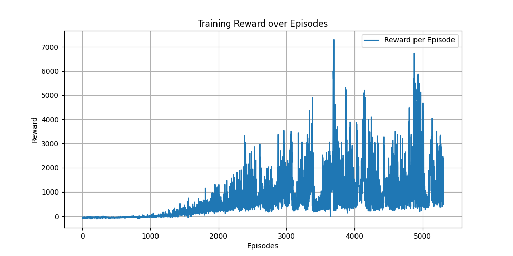
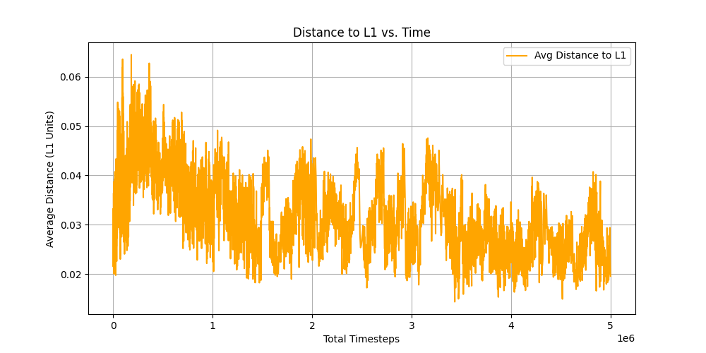

# Lagrange-Lock: Taming the Three-Body Problem with Reinforcement Learning
<video src="https://github.com/user-attachments/assets/59efcec9-c9b7-4394-9ebe-5f78b20ba3dc" autoplay loop muted playsinline width="50%"></video>

**Lagrange-Lock** is a research project dedicated to solving the station-keeping problem for satellites at Lagrange Points (specifically Earth-Moon L1) using Deep Reinforcement Learning. Unlike traditional control theory which requires precise mathematical linearization, our "Blind Pilot" AI (PPO) learns to surf the chaotic gravitational manifolds of the Circular Restricted Three-Body Problem (CR3BP).

**Core Metrics:**
* **Performance:** Physics engine ported to `Numba` JIT, achieving **~10,000 computation steps/second**.
* **Convergence:** Agent successfully discovers and maintains Halo orbits for **5,000+ timesteps** after 5 million training episodes.
* **Full-Stack Execution:** Custom `Gymnasium` environment bridged to a real-time `Three.js` WebGL frontend.

## 🧠 System Architecture & Mathematics

Our agent navigates the complex gravitational manifolds of the Earth-Moon system. For deep dives into the physics and AI architecture, refer to our core documentation:

* **[The Physics: CR3BP Theory](phase_1/CR3BP_Theory.md):** Detailed breakdown of the rotating reference frame, normalization ($\mu$), and the pseudo-potential function $\Omega(x,y,z)$.
* **[The Math: Lagrange Equilibrium](phase_1/Lagrange_Theory.md):** Mathematical derivation of collinear (L1, L2, L3) and triangular (L4, L5) Lagrange points.
* **[The AI: POMDP & PPO Strategy](phase_1/RL_Strategy.md):** How we handle noisy sensor states, control allocation vectors, and our custom reward function ($R = R_{survival} - R_{fuel} - R_{distance}$).
* **[The Engine](phase_2/PHASE_2_SUMMARY.md):** Architecture of our custom JavaScript RK4 integrator and Three.js visualization pipeline.

### 🛠️ Tech Stack
* **AI/ML Core:** Python, `Stable-Baselines3` (PPO), `Gymnasium`
* **Mathematical Compute:** `NumPy`, `Numba` (JIT Compilation), `SciPy`
* **Frontend Visualization:** HTML5, `Three.js` (WebGL)

## 📅 Project Roadmap & Progress

The project is structured into evolutionary phases, moving from mathematical theory to a full-stack AI simulation.

### ✅ Phase 1: Mathematical Foundations (Completed)
*   **Goal**: Validate the physics of the Three-Body Problem.
*   **Achievements**:
    *   Implemented the **CR3BP Equations of Motion** in Python.
    *   Derived the location of L1 through numerical root-finding (Newton-Raphson).
    *   Validated "Jacobi Constant" (Energy) conservation to ensure physics accuracy.

### ✅ Phase 2: The 3D Physics Engine (Completed)
*   **Goal**: Build a fast, visualized simulation environment.
*   **Achievements**:
    *   Expanded math to **3D space** ($z$-axis dynamics).
    *   Built a **Custom RK4 Integrator** in Python for trajectory propagation.
    *   Developed the first **Three.js Web Viewer** to visualize ballistic (non-controlled) particle paths in the browser.

### 🌟 Phase 3: The AI Pilot (Current Status: ~90% Complete)
*   **Goal**: Train an AI to autonomously maintain a Halo Orbit.
*   **Achievements**:
    *   **High-Performance Backend**: Ported physics to `Numba` JIT (~10,000 steps/sec).
    *   **Gymnasium Environment**: Created `SatelliteEnv` with a complex Reward Function (Stability + Fuel Efficiency).
    *   **PPO Integration**: Successfully integrated **Stable-Baselines3** to train the agent.
    *   **Interactive Control**: Upgraded the Web Viewer to communicate with the Python backend (`server.py`), allowing users to "Request AI Trajectories" on demand.
    *   **Result**: The AI successfully discovers and maintains Halo orbits for 5000+ timesteps.

### 🔮 Phase 4: Robustness & Realism (Future Work)
*   **Goal**: Prepare the Orbit-Keeping Agent for real-world uncertainties.
*   **Pending**:
    *   **Noisy Sensors**: Introduce Gaussian noise to position/velocity inputs to test the "Blind Pilot" theory.
    *   **Thruster Failures**: Disable 1-2 thrusters during simulation to force the AI to compensate.
    *   **Transfer Orbits**: Train a separate agent to *travel* to L1 from Earth GTO, rather than just spawning there.

## ♾️ Training Results & Convergence
<p align="center">
  
  
</p>

***Left**: The agent transitions from immediate crashes to sustained orbits around Episode 2,000. <br>
**Right**: Over 5 million timesteps, the average distance to the L1 point steadily decreases, proving optimization.*

---

## 🚀 Quick Start

### 1. Download & Setup

**Step 1: Clone the Repository**
```bash
git clone https://github.com/ItsMat78/Lagrange-Lock.git
cd Lagrange-Lock
```

**Step 2: Restore Node.js Dependencies**
```bash
npm install
```

**Step 3: Restore Python Dependencies**
*Create a virtual environment:*
```bash
python -m venv myenv
```
*Activate the virtual environment:*
- **Windows**: `.\myenv\Scripts\activate`
- **Mac/Linux**: `source myenv/bin/activate`

*Install required packages:*
```bash
pip install -r requirements.txt
```

### 2. Running the Simulation (Phase 3)
1.  **Start the Server**:
    ```bash
    python phase_3/server.py
    ```
2.  **Access the Interface**:
    *   Open **[http://localhost:8081/realtime_viewer.html](http://localhost:8081/realtime_viewer.html)** in your browser.
3.  **Deploy AI**:
    *   Go to the **AI Control** panel on the left.
    *   Select a model.
    *   Set number of timesteps, initial positions and intial velocities of satellite agent.
    *   Click **RUN AI**.
4. **Wait for 20 simulations to complete**:
    *   The environment will automatically load the best (highest reward) of a number of timesteps.
---

## 📂 Repository Structure

```
Lagrange-Lock/
│
├── phase_3/                  # 🌟 MAIN ACTIVE DIRECTORY
│   ├── server.py             # API Host & AI Inference Engine
│   ├── satellite_env.py      # Physics & Reward Logic (GymEnv)
│   ├── fast_dynamics.py      # Numba-Accelerated Math Core
│   ├── train_phase_3.py      # Training Script (PPO)
│   ├── realtime_viewer.html  # WebGL Frontend
│   └── models/               # Trained Agent Weights
│
├── phase_2/                  # Legacy 3D particles (No AI)
├── phase_1/                  # Legacy 2D Math Scripts
└── README.md                 # This file
```

---

## 👨‍💻 Credits
**Project Team**: Shreyash Rai, Sameer Choudhary <br>
**Supervisor**: Dr. Avantika Singh (IIIT Naya Raipur) <br>
**Date**: February 2026
